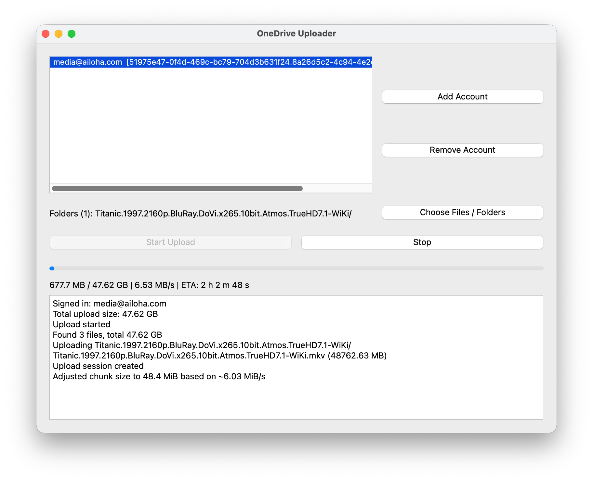

# OneDrive Uploader

[English](./README.md) | 中文简体

这是个基于 Python 和 PyQt 构建的、简单的**macOS**桌面图形界面应用程序，用于将文件和文件夹上传到 **OneDrive for Business**，支持断点续传。



## 🚀 功能特性

- 上传文件和文件夹到 **OneDrive for Business**
- **支持断点续传**
- 轻量简洁的图形界面
- 无需命令行操作
- 已在 **macOS Tahoe 26.0.1 (M2)** 上测试

## 🔒 权限与隐私

首次添加帐户跳转登录 OneDrive for Business 时，应用会请求以下三项权限：

| 权限 | 用途 |
|-------------|----------|
| **访问您OneDrive的所有文件** (`Files.ReadWrite.All`) | 用于上传、续传以及管理您在 OneDrive 中的文件。 |
| **保持对已向 OneDriveUploader 授权的数据访问权限** (`offline_access`) | 允许应用保持登录状态，无需每次都重新认证。 |
| **查看您的基本资料** (`User.Read`) | 用于识别您的账户（姓名、邮箱），以便安全存储登录会话。 |

> 这些是实现可续传文件上传所需的最小 Microsoft Graph 权限。
>
> 所有权限均通过微软官方登录流程授权；应用本身不会直接处理您的凭据。
>
> 应用不会上传、存储或分享您的数据给除微软 OneDrive 以外的任何外部服务。

## 📦 安装指南

1. 从 [Releases](https://github.com/ailoha/onedrive-uploader/releases) 下载最新的 `.dmg` 安装包。  
2. 打开 `.dmg` 文件，将 **OneDriveUploader.app** 拖入 **Applications** 文件夹。  
3. 启动 **OneDriveUploader.app**。  
4. 点击 **Add Account**，按照微软登录流程授权您的 OneDrive for Business 账户。  
5. 授权完成后，选择文件或文件夹开始上传。上传将在后台进行，若因网络波动等问题中断了可自动续传。

> ⚠️ macOS 可能会提示该应用来自未识别的开发者。
>
> 解决方法：右键点击（或按住 Control 点击）→ “打开” → 确认打开。

## 🧩 开发指南

### 环境要求  
- macOS 10.15 及以上版本  
- Python 3.12 及以上版本  

### 环境搭建
```bash
git clone https://github.com/ailoha/onedrive-uploader.git
cd onedrive-uploader
python3.12 -m venv venv
source venv/bin/activate
pip install -r requirements.txt
```

### 运行开发模式
```bash
python main.py
```

## 🤝 贡献指南

欢迎贡献！

您可以通过以下方式帮助项目：
- 提交问题反馈
- 提交错误修复或新功能的拉取请求
- 改进文档或界面体验

请遵循标准的 GitHub 工作流程：
1. Fork 本仓库  
2. 创建新分支  
3. 提交并推送您的更改  
4. 提交拉取请求

## 许可证

[MIT 许可证](LICENSE) — 免费使用、修改和分享。